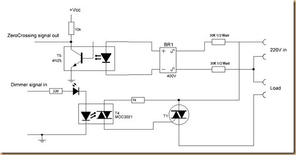

Dimmer-Raspberry Pi [inspired by](https://arduinodiy.wordpress.com/category/dimmer/ "Dimmer-Arduino")



**used library** 
1. pi4j
2. POSIX Threads
3. wiringPi

### Zero-crossing

A zero-crossing is a point where the sign of a mathematical function changes (e.g. from positive to negative or negative to positive), 
represented by a intercept of the axis (zero value) in the graph of the function. It is a commonly used term in electronics, 
mathematics, acoustics, and image processing.

Zero-Crossing


1. INT_EDGE_FALLING – Interrupt when the input goes from 1 to 0
2. INT_EDGE_RISING – Interrupt when the input goes from 0 to 1

220v with 50Hz AC we get 100 zero-crossings in a second, one each positive half-cycle is 10ms. 
To get within reasonable distance from zero-crossing to keep said TRIAC low 
we shouldn't activate the output for certain milliseconds between 1-10 after the event of zero-crossing, 
that means +-1ms tolerance. That doesn't mean 1ms reaction time - we can reasonably expect the next zero-crossing to occur 
precisely 10ms after the first one, or the fourth - 40ms. 
It's about granularity - if we allow 20ms for reaction, it must be between 19 and 21ms, not 18 or 22.
In our case we look for zero-crossing detection of RISING edge rather than falling.  (originally it was only chopping the negative half
 of the AC wave form). 

**we chopped 10ms into 128 part**
    
    total time 10ms 10,000 us
	0-128
	0-> 0us
	1-> 75us
	2-> 150us
	.
	.
	.
	.
	.
	.
	128-> 1000,000us

	s 1 -> 0 us
	s 2 -> 1875 us
	s 3 -> 5625 us
	s 4 -> 7500 us
	s 5 -> 10000 us

### Read write gpio pin
```cpp
#include<stdio.h>
#include<wiringPi.h>

#define led 4
#define button 17

void cleanup(){
    digitalWrite(led, 0);
}

int main(void){
    wiringPiSetupGpio();

    pinMode(led, OUTPUT);// delivery output from mpu
    pinMode(button, INPUT);//get input from i/o

    delay(1000);//delay just to be safe

    for(;;){
        delay(10);//10 millisecond delay
        if(digitalRead(button) == 1){
            digitalWrite(led,1);
        }else{
            digitalWrite(led,0);
        }
    }
    //cleanup();
}
```

### DELAY

VOID DELAY (UNSIGNED INT HOWLONG) AND VOID DELAYMICROSECONDS (UNSIGNED INT HOWLONG)

These two functions are used for delays and the delay() function was used in the previous. 
The delay() function takes a number and will delay for that many milliseconds. The delayMicroseconds() function does the same, 
except it delays for that many microseconds.

Now, for the main loop. I'm using a switch input for "user request" but you can use network, timer or whatever. 
All you need is to get the boolean value into in.

```cpp
#include <iostream>     // Include all needed libraries here
#include <wiringPi.h>

using namespace std;    // No need to keep using “std”

int main() {
   wiringPiSetup();        // Setup the library
   pinMode(0, OUTPUT);     // Configure GPIO0 as an output

   // Main program loop
   while(1) {
      // Toggle the LED
         digitalWrite(0, !digitalRead(0));

      // Delay for 500ms
      delay(500);
      //delayMicroseconds()
   }
   return 0;
}
```

### Interrupt

> int wiringPiISR (int pin, int edgeType,  void (*function)(void)) ;

This function registers a function to received interrupts on the specified pin. 
The edgeType parameter is either **INT_EDGE_FALLING**, **INT_EDGE_RISING**, **INT_EDGE_BOTH** or **INT_EDGE_SETUP**. 
the pin elsewhere (e.g. with the gpio program), but if you specify one of the other types, 
then the pin will be exported and initialised as specified. This is accomplished via a suitable call to the gpio utility program, 
so it need to be available. The pin number is supplied in the current mode – native wiringPi, BCM_GPIO, physical or Sys modes.

This function will work in any mode, and d**oes not need root privileges** to work.

The function will be called when the interrupt triggers. When it is triggered, it’s cleared in the dispatcher before calling your function, 
so if a subsequent interrupt fires before you finish your handler, then it won’t be missed. (However it can only track one more interrupt, 
if more than one interrupt fires while one is being handled then they will be ignored)

**_This function is run at a high priority_** (if the program is run using sudo, or as root) and **executes concurrently with the main program**. 
It has full access to all the global variables, open file handles and so on.
The edge type can be one of three different options:

1. INT_EDGE_FALLING – Interrupt when the input goes from 1 to 0
2. INT_EDGE_RISING – Interrupt when the input goes from 0 to 1
3. INT_EDGE_BOTH – Interrupt when the input changes

```cpp
#include <iostream>     // Include all needed libraries here
#include <wiringPi.h>

using namespace std;    // No need to keep using “std”

void switchInterrupt(void);   // Function prototype

int main() {
   wiringPiSetup();        // Setup the library
   pinMode(0, OUTPUT);     // Configure GPIO0 as an output
   pinMode(1, INPUT);      // Configure GPIO1 as an input

   // Cause an interrupt when switch is pressed (0V)
   wiringPiISR (1, INT_EDGE_FALLING, switchInterrupt) ;

   // Main program loop
   while(1){
      // Toggle the LED
      digitalWrite(0, !digitalRead(0));
      delay(500);
   }

   return 0;
}

// Our interrupt routine
void switchInterrupt(void) {
   cout << “Button pressed” << endl;
}
```

### Concurrency with posix api

Kernels shipped since 2.6.25 have set the rt_bandwidth value for the default group to be 0.95 out of every 1.0 seconds.
In other words, the group scheduler is configured, by default, to reserve 5% of the CPU for non-SCHED_FIFO tasks.
SCHED_FIFO and SCHED_RR are so called "real-time" policies.
SCHED_FIFO and SCHED_RR are so called "real-time" policies. They implement the fixed-priority real-time scheduling specified by the POSIX standard.
Tasks with these policies preempt every other task, which can thus easily go into starvation (if they don't release the CPU).

```cpp
#include<iostream>
#include<cstdlib>
#include<pthread.h>
#include<sched.h>
#include <stdio.h>
#include <stdlib.h>

using namespace std;

#define NUM_THREADS 6
volatile int stepCounter = 0 ;

void readDimValueFromTextFile(); 
void *ProcessorMajorTask(void *threadid);
void *Remote(void *threadid);

void *ProcessorMajorTask(void *threadid) {
  long tid;
  int k = 0;
  tid = (long)threadid;
  cout << "Hello Processor! Thread ID, " << tid << endl;

  for (k = 0 ; k< 20;k++){
    stepCounter++;
    printf("processor thread %d stepCounter %d \n", k, stepCounter);
  }

  pthread_exit(NULL);
}

void *Remote(void *threadid) {
  long tid;
  int j = 0;
  tid = (long)threadid;
  cout << "\nHello Remot 4 ! Thread ID, " << tid << endl;

  for (j = 0 ; j< 20;j++){
    stepCounter++;
    printf("Remot 4 thread %d stepCounter %d \n", j, stepCounter);

    if (j == 15){
    printf("stepCounter old value %d ",stepCounter);
      readDimValueFromTextFile();
      printf("stepCounter new value %d ",stepCounter);
    }
  }
  pthread_exit(NULL);
}

int main () {
  pthread_t remoteThread;
  pthread_t processorThread;
  int processor, remoteFlag, ret;

  /**start configuring processor thread with higher priority**/
  struct sched_param  param;
  pthread_attr_t thread_attr;
  pthread_attr_init(&thread_attr);  // Initialise the attributes
  //SCHED_FIFO is a simple scheduling algorithm without time slicing.
  pthread_attr_setschedpolicy(&thread_attr, SCHED_FIFO);  // Set attributes to FIFO policy
  param.sched_priority = 50;
  std::cout << "Trying to set thread realtime prio = " << param.sched_priority << std::endl;

  ret = pthread_attr_setschedparam(&thread_attr, &param); // Set attributes to priority 95

  if (ret != 0) {
    // Print the error
    std::cout << "Unsuccessful in setting thread realtime prio" << std::endl;
  } else{
    std::cout << "Successful in setting thread realtime prio" << std::endl;
  }

  /* processor thread configuration end **/


  cout << "\nmain() : creating remoteThread " << endl;
  remoteFlag = pthread_create(&remoteThread, NULL, Remote, (void *)0);


  cout << "\nmain() : creating processorThread " << endl;
  processor = pthread_create(&processorThread, &thread_attr, ProcessorMajorTask, (void *)1);

  if (processor != 0){
    printf("\nprocessor thread create failed error");
  } else{
    printf("\nprocessor thread create success : ");
  }

  // Now verify the change in thread priority
  int policy = 0;
  ret = pthread_getschedparam(processorThread, &policy, &param);
    if (ret != 0) {
      std::cout << "Couldn't retrieve real-time scheduling paramers" << std::endl;
    } else {
      std::cout << "Retrieve real-time scheduling paramers success" << std::endl;
    }
  // Check the correct policy was applied
  if(policy != SCHED_FIFO) {
    std::cout << "\nScheduling is NOT SCHED_FIFO!\n" << std::endl;
  } else {
    std::cout << "\nSCHED_FIFO OK\n\n" << std::endl;
  }


  pthread_exit(NULL);
}

void readDimValueFromTextFile(){

   int num;
   FILE *fptr;

   if ((fptr = fopen("test.txt","r")) == NULL) {       // checks if file exists
       puts("File not exists");
       exit(1);                    // for exit(1) is required #include <stdlib.h>
   } else{
      fscanf(fptr,"%d", &num);
      printf("Remote parameter is:  %d\n", num);
      fclose(fptr);
      printf("stepCounter is:  %d\n", stepCounter);

      if (stepCounter < 0){
        stepCounter = 0;
      } else if (stepCounter > 128){
        stepCounter = 128;
      } else{
            stepCounter = stepCounter+num;
      }
      
      printf("agter read from file stepCounter new value is:  %d\n", stepCounter);

   }
}

// g++ -o a.out concurrentCmSCHED_RR.cpp && ./a.out
//g++ -o a.out concurrentCmSCHED_RR.cpp -lpthread && ./a.out
```

### Voltage regulator Pseudo Code

```cpp
/*
 * isr.c:
 * Wait for Interrupt test program - ISR method
 to do make it parallel
 read dim value
 */
#include<iostream>
#include<cstdlib>
#include<stdio.h>
#include<string.h>
#include<errno.h>
#include<stdlib.h>
#include<wiringPi.h>
#include<pthread.h>
#include<sched.h>

using namespace std;

// What GPIO input are we using?
// This is a wiringPi pin number
#define FAN_PIN 3   // Output to Opto Triac
#define INTERRUPT_PIN 2 //#define directive allows the definition of macros within your source code
#define FREQ_STEP 75   // This is the delay-per-brightness step in microseconds.

#define PIN_HIGH 1 //1 == HIGH
#define PIN_LOW 0 //2 == LOW

volatile boolean zeroCross=0;
// Boolean to store a "switch" to tell us if we have crossed zero
volatile int stepCounter = 0;  
// Should be declared volatile to make sure the compiler doesn't cache it.

int dim = 128;  // Dimming level (0-128)  0 = on, 128 = 0ff
int pas = 14;   // step for count;

void zeroCrossDetect(void) {    
  zeroCross = true; // set the boolean to true to tell our dimming function that a zero cross has occured
  stepCounter=0;
  digitalWrite(FAN_PIN, PIN_LOW); // // turn off fan
}    

// Turn on the TRIAC at the appropriate time
void dimCheck(void) {                   
  if(zeroCross == true) {              
    if(stepCounter>=dim) {                     
      digitalWrite(FAN_PIN, PIN_HIGH);  // turn on fan       
      stepCounter = 0;  // reset time step counter                         
      zeroCross=false;    // reset zero cross detection
    } else {
      stepCounter++;  // increment time step counter                     
    }                                
  }    
}  

void setDimMethod(void){
    dim = 64;
}

int main (void){

  if (wiringPiSetup () < 0) {
    fprintf (stderr, "Unable to setup wiringPi: %s\n", strerror (errno)) ;
    return 1 ;
  }

  pinMode(FAN_PIN, OUTPUT);  // Set the Triac pin as output

  if (wiringPiISR (INTERRUPT_PIN, INT_EDGE_RISING, &zeroCrossDetect) < 0) {
    fprintf (stderr, "Unable to setup ISR: %s\n", strerror (errno)) ;
    return 1 ;
  }

  setDimMethod();

  for (;;) {

    printf ("Waiting ... ");

    delayMicroseconds(FREQ_STEP);

    dimCheck();
    fflush (stdout) ;

    printf ("dimCheck called -> \n") ;

  }
  return 0 ;
}
```

### Our desired Regulator 

#### File name Regulator.cpp
```cpp
#include<iostream>
#include<cstdlib>
#include<pthread.h>
#include<sched.h>
#include <stdio.h>
#include <stdlib.h>
#include<string.h>
#include<errno.h>
#include<wiringPi.h>

using namespace std;

// What GPIO input are we using?
// This is a wiringPi pin number
#define FAN_PIN 3   // Output to Opto Triac
#define INTERRUPT_PIN 2 //#define directive allows the definition of macros within your source code
#define FREQ_STEP 75   // This is the delay-per-brightness step in microseconds.
#define PIN_HIGH 1 //1 == HIGH
#define PIN_LOW 0 //2 == LOW

volatile boolean zeroCross=0;
// Boolean to store a "switch" to tell us if we have crossed zero
volatile int stepCounter = 0;  
// Should be declared volatile to make sure the compiler doesn't cache it.

int dim = 128;  // Dimming level (0-128)  0 = on, 128 = 0ff
int pas = 14;   // step for count;

void zeroCrossDetect(void);
void dimCheck(void);
void *ProcessorMajorTask(void *threadid);
void *Remote(void *threadid);

void *ProcessorMajorTask(void *threadid) {
  long tid;
  int k = 0;
  tid = (long)threadid;
  cout << "Hello Processor! Thread ID, " << tid << endl;

  for (;;) {
    printf ("Waiting ... ");
    delayMicroseconds(FREQ_STEP);
    dimCheck();
    fflush (stdout) ;
    printf ("dimCheck called -> \n") ;
  }

  pthread_exit(NULL);
}

void *Remote(void *threadid) {
  long tid;
  int j = 0;
  int num;
  FILE *fptr;
  tid = (long)threadid;
  cout << "\nHello Remot ! Thread ID, " << tid << endl;


  for (;;) {
    printf ("Waiting ... ");
    delay(1000);//1000ms
    printf("Remot thread \n");

   if ((fptr = fopen("test.txt","r")) == NULL) {       // checks if file exists
       puts("File not exists");
       exit(1);                    // for exit(1) is required #include <stdlib.h>
   } else{
      fscanf(fptr,"%d", &num);
      printf("Remote parameter is:  %d\n", num);
      fclose(fptr);
      printf("stepCounter is:  %d\n", stepCounter);

      if (stepCounter < 0){
        stepCounter = 0;
      } else if (stepCounter > 128){
        stepCounter = 128;
      } else{
            stepCounter = stepCounter+num;
      }
      printf("agter read from file stepCounter new value is:  %d\n", stepCounter);
   }
  }
  pthread_exit(NULL);
}

int main () {
  pthread_t remoteThread;
  pthread_t processorThread;
  int processor, remoteFlag, ret;

  //configuring basic setup, pin, interrupt,

  if (wiringPiSetup () < 0) {
    fprintf (stderr, "Unable to setup wiringPi: %s\n", strerror (errno)) ;
    return 1 ;
  }

  pinMode(FAN_PIN, OUTPUT);  // Set the Triac pin as output

  if (wiringPiISR (INTERRUPT_PIN, INT_EDGE_RISING, &zeroCrossDetect) < 0) {
    fprintf (stderr, "Unable to setup ISR: %s\n", strerror (errno)) ;
    return 1 ;
  }

  /**start configuring processor thread with higher priority**/
  struct sched_param  param;
  pthread_attr_t thread_attr;
  pthread_attr_init(&thread_attr);  // Initialise the attributes
  //SCHED_FIFO is a simple scheduling algorithm without time slicing.
  pthread_attr_setschedpolicy(&thread_attr, SCHED_FIFO);  // Set attributes to FIFO policy
  param.sched_priority = 50;
  std::cout << "Trying to set thread realtime prio = " << param.sched_priority << std::endl;

  ret = pthread_attr_setschedparam(&thread_attr, &param); // Set attributes to priority 95

  if (ret != 0) {
    // Print the error
    std::cout << "Unsuccessful in setting thread realtime prio" << std::endl;
  } else{
    std::cout << "Successful in setting thread realtime prio" << std::endl;
  }

  /* processor thread configuration end **/


  cout << "\nmain() : creating remoteThread " << endl;
  remoteFlag = pthread_create(&remoteThread, NULL, Remote, (void *)0);


  cout << "\nmain() : creating processorThread " << endl;
  processor = pthread_create(&processorThread, &thread_attr, ProcessorMajorTask, (void *)1);

  if (processor != 0){
    printf("\nprocessor thread create failed error");
  } else{
    printf("\nprocessor thread create success : ");
  }

  // Now verify the change in thread priority
  int policy = 0;
  ret = pthread_getschedparam(processorThread, &policy, &param);
    if (ret != 0) {
      std::cout << "Couldn't retrieve real-time scheduling paramers" << std::endl;
    } else {
      std::cout << "Retrieve real-time scheduling paramers success" << std::endl;
    }
  // Check the correct policy was applied
  if(policy != SCHED_FIFO) {
    std::cout << "\nScheduling is NOT SCHED_FIFO!\n" << std::endl;
  } else {
    std::cout << "\nSCHED_FIFO OK\n\n" << std::endl;
  }

  pthread_exit(NULL);
}

void zeroCrossDetect(void) {    
  zeroCross = true; // set the boolean to true to tell our dimming function that a zero cross has occured
  stepCounter=0;
  digitalWrite(FAN_PIN, PIN_LOW); // // turn off fan
}    

// Turn on the TRIAC at the appropriate time
void dimCheck(void) {                   
  if(zeroCross == true) {              
    if(stepCounter>=dim) {                     
      digitalWrite(FAN_PIN, PIN_HIGH);  // turn on fan       
      stepCounter = 0;  // reset time step counter                         
      zeroCross=false;    // reset zero cross detection
    } else {
      stepCounter++;  // increment time step counter                     
    }                                
  }    
}  

// g++ -o a.out concurrentCmSCHED_RR.cpp && ./a.out
//g++ -o a.out concurrentCmSCHED_RR.cpp -lpthread && ./a.out
```