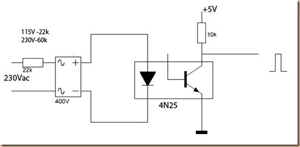
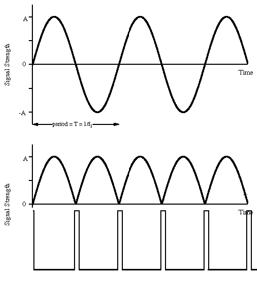
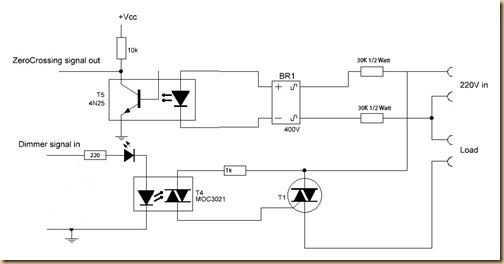
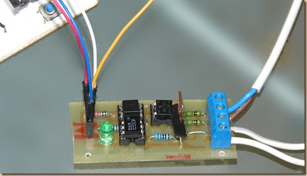
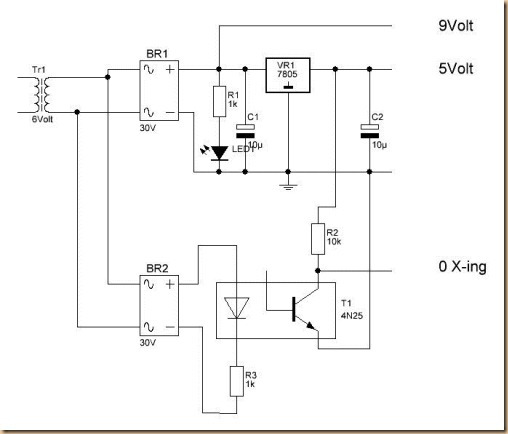

#  [Dimmer-Arduino](https://arduinodiy.wordpress.com/category/dimmer/ "Dimmer-Arduino")
Switching an AC load with an Arduino is rather simple: either a mechanical Relay or a solid state relay with an optically isolated Triac.
It becomes a bit more tricky if one wants to dim a mains AC lamp with an arduino: just limiting the current through a 
Triac is not really possible due to the large power the triac then will need to dissipate, resulting in much heat and it is also not efficient from an energy use point of view.

The proper way to do it is through phase control: the Triac then is fully opened, but only during a part of the sinoid AC wave.
One could an Arduino just let open the Triac for a number of microseconds, but that has the problem that it is unpredictable 
during what part of the sinuswave the triac opens and therefore the dimming level is unpredictable. One needs a reference point in the sinus wave.
For that a zero crossing detector is necessary. This is a circuit that tells the Arduino (or another microcontroller) when 
the sinus wave goes through zero and therefore gives a defined point on that sinus wave.
Opening the Triac for a number of microseconds after the zero crossing therefore gives a predictable level of dimming.



Such a circuit is easy to build: The zero crossing is directly derived from the rectified mains AC lines – via an optocoupler 
of course- and gives a signal every time the wave goes through zero. Because the sine wave first goes through double phased rectification (see figure below), 
the zero-crossing signal is given regardless whether the sinus wave goes up through zero or down through zero. This signal then can be used to steer an interrupt in the



Opening the Triac is done via a tried and tested opto coupled Triac circuit. For the Triac a TIC206 can be used, 
but a BT136 (a bit cheaper)  would probably work as well. With regard to the MOC3021: 
that has a forward voltage of about 1.2-1.4 Volts and a trigger current of 8-15 mA. An LED has a forward voltage of about 2Volts. 
Presuming a 5V digital steering signal that gives a resistor value between (5-3.2)/0.015= 120 Ohm and (5-3.2)/0.008=225 Ohm, making 220 a decent choice. 
In reality an LED may have a slightly lower forward voltage and a 330 Ohm resistor was found to work as well. 
It is important NOT to chose an opto-Triac here with an inbuilt zero-crossing filter. The MOC3041 or the MOC3061 for that matter therefore is not usable in this circuit. 
The MOC 3021 is. NOTE: some people have experienced flicker as a result of a weak input signal. As the voltage drop over an LED may vary depending on the color. 
it is safer to replace the LED by a wire bridge and increase the 220 Ohm resistor to 330 or 470 Ohm With regard to the 30k resistors: 
The 1/2 Watt should do it as the resistors dissipate some 400mW. If you think that is too much, replace the 4N25 with a 4N33 and the two 30k resistors with two 100 k resistors. 
Be careful though in using sensitive optocouplers as the 4N32 as they will easily be fully in saturation.




All one needs then is the software. Below a piece of demo software. Due to use of ‘delay()’ it does not work efficiently meaning that the microcontroller can’t do much else, but if you just want to dim a light that is fine.


```cpp
/*
AC Voltage dimmer with Zero cross detection
Author: Charith Fernanado http://www.inmojo.com
License: Creative Commons Attribution Share-Alike 3.0 License. 

Attach the Zero cross pin of the module to Arduino External Interrupt pin
Select the correct Interrupt # from the below table:
(the Pin numbers are digital pins, NOT physical pins:
digital pin 2 [INT0]=physical pin 4 
and digital pin 3 [INT1]= physical pin 5)

 Pin    |  Interrrupt # | Arduino Platform
 ---------------------------------------
 2      |  0            |  All
 3      |  1            |  All
 18     |  5            |  Arduino Mega Only
 19     |  4            |  Arduino Mega Only
 20     |  3            |  Arduino Mega Only
 21     |  2            |  Arduino Mega Only

In the program pin 2 is chosen
 */

int AC_LOAD = 3;    // Output to Opto Triac pin
int dimming = 128;  // Dimming level (0-128)  0 = ON, 128 = OFF
/* Due to timing problems, the use of ‘0’ can sometimes make the circuit 
flicker. It is safer to use a value slightly higher than ‘0’
*/
void setup(){
  pinMode(AC_LOAD, OUTPUT);// Set AC Load pin as output
  attachInterrupt(0, zero_crosss_int, RISING);  
  // Chooses '0' as interrupt for the zero-crossing
}
// the interrupt function must take no parameters and return nothing
void zero_crosss_int(){
  // function to be fired at the zero crossing to dim the light

  // Firing angle calculation : 1 full 50Hz wave =1/50=20ms  
  // Every zerocrossing thus: (50Hz)-> 10ms (1/2 Cycle) For 60Hz => 8.33ms

  // 10ms=10000us
  // (10000us - 10us) / 128 = 75 (Approx) For 60Hz =>65
  int dimtime = (75*dimming);    // For 60Hz =>65     
  delayMicroseconds(dimtime);    // Off cycle
  digitalWrite(AC_LOAD, HIGH);   // triac firing
  delayMicroseconds(10);         // triac On propogation delay
                                 //(for 60Hz use 8.33)
  digitalWrite(AC_LOAD, LOW);    // triac Off
}
void loop()  {
 for (int i=5; i <= 128; i++){
  dimming=i;
  delay(10);
 }
}

```

### Code below uses the timer function instead of delays

```cpp
/*AC Light Control
 
 Updated by Robert Twomey 
 
 Changed zero-crossing detection to look for RISING edge rather
 than falling.  (originally it was only chopping the negative half
 of the AC wave form). 
 
 Also changed the dim_check() to turn on the Triac, leaving it on 
 until the zero_cross_detect() turn's it off.
 
 Adapted from sketch by Ryan McLaughlin 
 http://www.arduino.cc/cgi-bin/yabb2/YaBB.pl?num=1230333861/30
 
 */

#include  <TimerOne.h>          // Avaiable from http://www.arduino.cc/playground/Code/Timer1
volatile int i=0;               // Variable to use as a counter volatile as it is in an interrupt
volatile boolean zero_cross=0;  // Boolean to store a "switch" to tell us if we have crossed zero
int AC_pin = 11;                // Output to Opto Triac
int dim = 0;                    // Dimming level (0-128)  0 = on, 128 = 0ff
int inc=1;                      // counting up or down, 1=up, -1=down

int freqStep = 75;    // This is the delay-per-brightness step in microseconds.
                      // For 60 Hz it should be 65
// It is calculated based on the frequency of your voltage supply (50Hz or 60Hz)
// and the number of brightness steps you want. 
// 
// Realize that there are 2 zerocrossing per cycle. This means
// zero crossing happens at 120Hz for a 60Hz supply or 100Hz for a 50Hz supply. 

// To calculate freqStep divide the length of one full half-wave of the power
// cycle (in microseconds) by the number of brightness steps. 
//
// (120 Hz=8333uS) / 128 brightness steps = 65 uS / brightness step
// (100Hz=10000uS) / 128 steps = 75uS/step

void setup() {                                      // Begin setup
  pinMode(AC_pin, OUTPUT);                          // Set the Triac pin as output
  attachInterrupt(0, zero_cross_detect, RISING);    // Attach an Interupt to Pin 2 (interupt 0) for Zero Cross Detection
  Timer1.initialize(freqStep);                      // Initialize TimerOne library for the freq we need
  Timer1.attachInterrupt(dim_check, freqStep);      
  // Use the TimerOne Library to attach an interrupt
  // to the function we use to check to see if it is 
  // the right time to fire the triac.  This function 
  // will now run every freqStep in microseconds.                                            
}

void zero_cross_detect() {    
  zero_cross = true;               // set the boolean to true to tell our dimming function that a zero cross has occured
  i=0;
  digitalWrite(AC_pin, LOW);       // turn off TRIAC (and AC)
}                                 

// Turn on the TRIAC at the appropriate time
void dim_check() {                   
  if(zero_cross == true) {              
    if(i>=dim) {                     
      digitalWrite(AC_pin, HIGH); // turn on light       
      i=0;  // reset time step counter                         
      zero_cross = false; //reset zero cross detection
    } 
    else {
      i++; // increment time step counter                     
    }                                
  }                                  
}                                   

void loop() {                        
  dim+=inc;
  if((dim>=128) || (dim<=0))
    inc*=-1;
  delay(18);
}
```

### Arduino code {Arduino 230v Light Bulb Dimming (Portugal 220V 50 Hz)} 

```cpp
//source: http://electronics.stackexchange.com/q/59615

int AC_LOAD = 3;    // Output to Opto Triac pin
int dimming = 128;  // Dimming level (0-128)  0 = ON, 128 = OFF

void setup(){

  pinMode(AC_LOAD, OUTPUT);       // Set the AC Load as output
  attachInterrupt(0, zero_crosss_int, RISING);  // Choose the zero cross interrupt # from the table above
}

void zero_crosss_int(){  // function to be fired at the zero crossing to dim the light

  // Firing angle calculation :: 50Hz-> 10ms (1/2 Cycle)
  // (10000us - 10us) / 128 = 75 (Approx)
  int dimtime = (75*dimming);      
  delayMicroseconds(dimtime);    // Off cycle
  digitalWrite(AC_LOAD, HIGH);   // triac firing
  delayMicroseconds(10);         // triac On propogation delay
  digitalWrite(AC_LOAD, LOW);    // triac Off
}

void loop(){
  dimming = 128; 
  delay(100);
  dimming = 75;  
  delay(100);
  dimming = 25;  
  delay(100);
}
```


# Your task is to modify source code and write your own way



On thing to consider is that if you are building a system in which you are not using a ready made PSU but rather supply your own PSU, 
built from a transformer and a rectifier, you could consider picking up the 0-crossing from the secondary side of the transformer.

A possible circuit could look like this


**Using the dimmer with a fan**
A question I often get is if this circuit can be used with a (ceiling)fan. Well a Triac is not particularly good at regulating 
inductive loads and the speed of many AC-motors in fact set by the frequency of the grid and the number of poles.  (rmp=120*f/p). 
However, the Shaded-pole motor can be regulated with a Triac and the shaded pole motor is often (but not always as the PSC motor is common too) found in fans. [Check here](https://www.youtube.com/watch?v=JTlHNOaBnPI "Speed Control for Shaded Pole and PSC motors").
